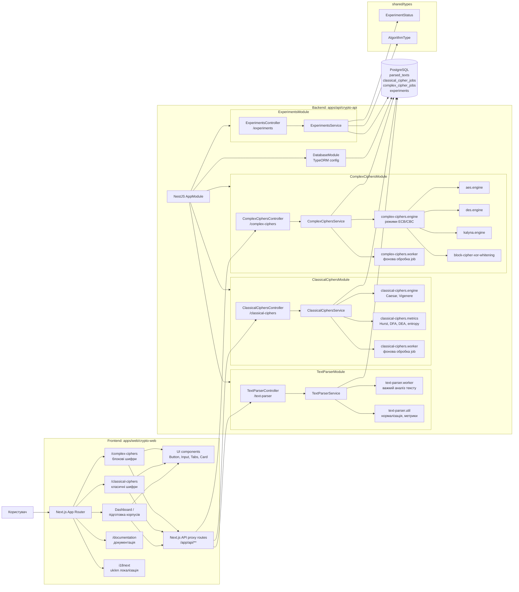
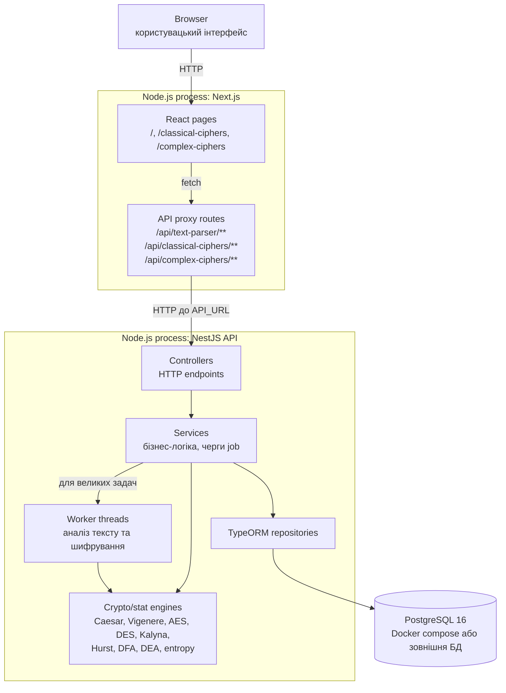
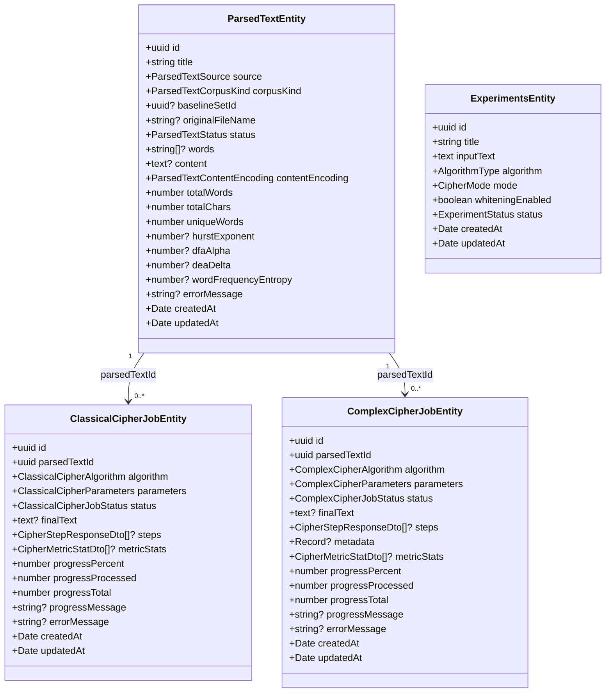
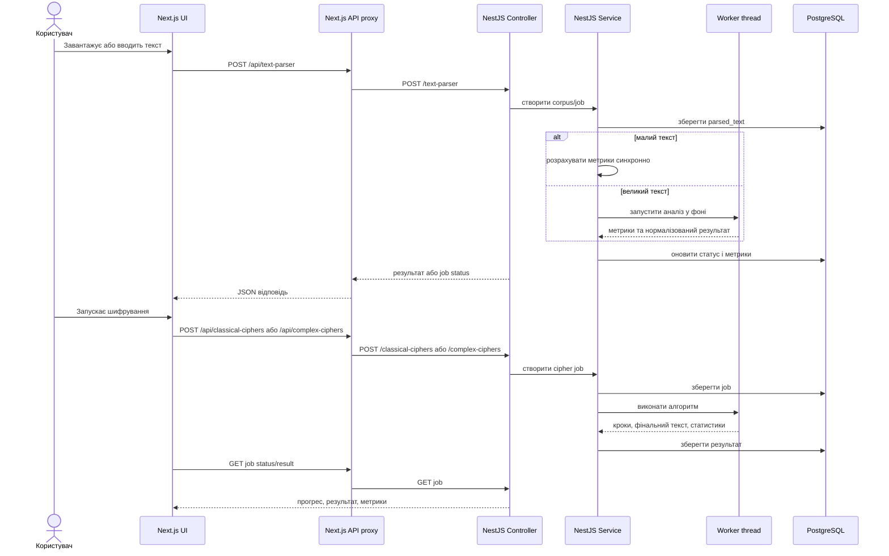

# UML-діаграми архітектури Crypto Thesis Platform

## 1. Компонентна діаграма застосунку

## 2. Діаграма розгортання і потоків даних

## 3. Діаграма основних сутностей

## 4. Основні сценарії використання

## 5. Короткий опис компонентів

- `crypto-web` - клієнтський Next.js застосунок із сторінками для підготовки корпусів, запуску класичних і блокових шифрів, перегляду результатів та документації.
- `Next.js API proxy routes` - проміжний шар, який приховує адресу backend API від UI і проксить запити на `API_URL`.
- `crypto-api` - NestJS backend, що містить HTTP-контролери, сервіси, TypeORM-збереження та worker threads для ресурсоємних задач.
- `TextParserModule` - створення корпусів, нормалізація тексту, генерація випадкових байтів, baseline-набори, обчислення статистичних метрик.
- `ClassicalCiphersModule` - шифри Цезаря та Віженера, покрокове виконання, job-и, метрики результатів.
- `ComplexCiphersModule` - AES, DES, Kalyna, режими ECB/CBC, кодування `utf8/hex/base64`, XOR whitening, job-и та проміжні кроки.
- `ExperimentsModule` - допоміжний модуль для збереження базових експериментів із алгоритмом, режимом, whitening і статусом.
- `PostgreSQL` - основне сховище корпусів, задач шифрування, результатів, прогресу, помилок і метрик.
- `shared/types` - спільні enum-типи для статусів експериментів і алгоритмів.
